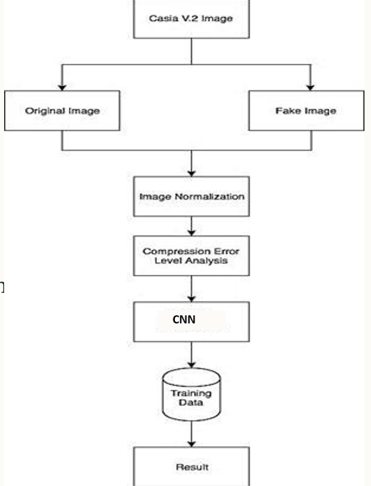

# Image Forgery Detection

**Identifying Manipulated Images and Unveiling Hidden Alterations**

## Table of Contents
- [Project Overview](#project-overview)
- [Video link](#video-link)
- [Objectives](#objectives)
- [Dataset](#dataset)
- [Model](#model)
- [Performance](#performance)
- [Literature Review](#literature-review)
- [Technologies Used](#technologies-used)
- [Setup Instructions](#setup-instructions)
- [Future Directions](#future-directions)
- [License](#license)

## Project Overview
The **Image Forgery Detection** project aims to identify manipulated or forged images using deep learning techniques. This project explores various image tampering methods, such as splicing, copy-move, and retouching, and leverages neural networks to detect such alterations with high accuracy.
## Video link
https://drive.google.com/drive/folders/1YBi4e9qpvueWWpfEsKuJ1WHylzWR22Ik?usp=sharing

## Objectives
- **Identify Forged Images**: Distinguish between authentic and manipulated images.
- **Develop Detection Techniques**: Explore and refine methods to enhance detection accuracy.
- **Evaluate Performance**: Measure the model's performance on unseen data.
- **Contribute to Security**: Strengthen digital security through advanced forgery detection.

## Dataset
The model is trained and tested on the **CASIA V.2 Dataset**, which consists of over 12,500 images:
- **Authentic Images**: 7,490 original images.
- **Tampered Images**: 5,122 manipulated images, including:
  - Spliced images
  - Copy-move forgeries
  - Retouched images
https://www.kaggle.com/datasets/sophatvathana/casia-dataset/data?select=CASIA2

## Model
The project uses a **Convolutional Neural Network (CNN)** architecture for forgery detection. The workflow of the model includes:
1. **Input Layer**: Raw image data.
2. **Convolutional Layers**: Extract image features.
3. **Pooling Layers**: Downsample and reduce dimensionality.
4. **Fully Connected Layers**: Perform classification.
5. **Output Layer**: Predict whether the image is forged or authentic.

The model is also enhanced with **Error Level Analysis (ELA)**, a technique used to check image compression levels. Images with more compression show lower ELA, while less compression results in higher ELA, helping to spot inconsistencies caused by manipulation.




## Performance
The model demonstrates high accuracy and recall rates:
- **Accuracy on Unseen Data**: 94.95%
- **Accuracy on Training Data**: 94.80%
- **Recall**: 97% (minimizing false negatives)
- **F1-score**: 95% (balancing precision and recall)

## Literature Review

1. **Image forgery detection using error level analysis and deep learning**  
   - **Data Preprocessing**: Image normalization, ELA  
   - **Model Used**: VGG 16  
   - **Remarks**: Training Accuracy: 92.2%, Validation Accuracy: 88.46%

2. **Detection and localization of image forgeries using improved mask regional convolutional neural network**  
   - **Data Preprocessing**: Synthetic dataset creation using COCO dataset to generate copy-move and splicing forgeries  
   - **Model Used**: Improved Mask R-CNN with Feature Pyramid Network (FPN) and ResNet-101 backbone, Sobel filter for edge detection  
   - **Remarks**: Higher AP and F1 scores, robust to JPEG compression and resizing attacks, AP improved from 0.713 to 0.769 using Sobel filter. Processing speed of 5 FPS

3. **Copy-Move Forgery Detection using Integrated DWT and SURF**  
   - **Data Preprocessing**: Discrete Wavelet Transform (DWT) for reducing image dimensions  
   - **Model Used**: Combination of DWT and Speeded-Up Robust Features (SURF)  
   - **Remarks**: 95% accuracy in detecting copy-move forgery, especially with geometric transformations like rotation and scaling

4. **Image Forgery Detection using Deep Learning: A Survey**  
   - **Data Preprocessing**: Hand-crafted feature extraction (DCT, DWT, PCA, SIFT, SURF for traditional methods), data augmentation and normalization for deep learning  
   - **Model Used**: CNNs, MFCN, Autoencoders, Stacked Autoencoders, RRU-Net, BusterNet  
   - **Remarks**: Deep learning methods outperform traditional ones by automatically learning complex features but require large datasets and high computational power

## Technologies Used
- **Dataset**: CASIA V.2
- **Deep Learning Framework**: TensorFlow / PyTorch (depending on the specific framework used in the implementation)
- **Error Level Analysis (ELA)**
- **Convolutional Neural Networks (CNN)**

## Setup Instructions

### Frontend (Vite)
1. Install [Node.js](https://nodejs.org/).
2. Install the necessary dependencies:
   ```bash
   npm install
3 Follow the prompts to set up your project with React or other preferred frameworks.
Run Frontend
   ```bash
   npm run dev
```
4 Create the app.py File
In your project directory, run file named app.py using following code:
```
python app.py
```
The backend will now be running locally on http://127.0.0.1:5000/.
